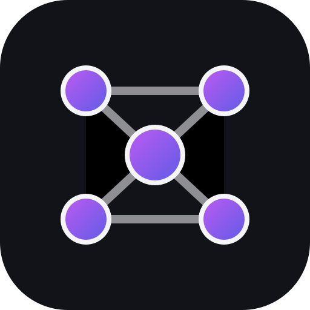

# ml5.swift

<p align="center"></p>

[](https://github.com/ezefranca/ml5.swift/actions/workflows/tests.yml)
[](https://ezefranca.com/ml5.swift/documentation/ml5/)
[](https://swiftpackageindex.com/ezefranca/ml5.swift)
[](Scripts/check_coverage.py)


[](LICENSE)

ml5.swift provides approachable, typed, on-device machine learning for Apple platforms. Inspired conceptually by [ml5.js](https://ml5js.org/), it uses Core ML, Vision, MPSGraph, Metal, Accelerate, and Swift concurrency directly—without TensorFlow.js or a browser runtime.

The package is a pre-1.0 release candidate. Its public API, DocC inventory, 100% production line/region coverage gates, and macOS/iOS build matrix are enforced in CI.

## Add the package

```swift
dependencies: [
    .package(url: "https://github.com/ezefranca/ml5.swift", branch: "main")
]
```

Add the `ML5` product to your target and `import ML5`.

## Train and predict

```swift
import ML5

let samples = try (-2...2).map { value in
    try DenseTrainingSample(
        features: FeatureVector(["x": .number(Double(value))]),
        targets: [(2 * Double(value)) + 1]
    )
}
let configuration = try DenseNetworkConfiguration(
    inputFeatures: ["x"],
    outputNames: ["y"],
    epochs: 40,
    validationFraction: 0,
    seed: 7
)
let result = try await DenseCPUTrainer().train(samples, configuration: configuration)
let prediction = try await result.model.predict(
    FeatureVector(["x": .number(3)])
)
```

Choose deterministic CPU training, explicit MPSGraph acceleration, or a declared automatic fallback policy. Loaded Core ML models remain inference-only unless an application supplies a training adapter. See [Getting Started](Sources/ML5/ML5.docc/GettingStarted.md) and the [complete DocC site](https://ezefranca.com/ml5.swift/documentation/ml5/).

## Model surface

- Validated scalar, tensor, sequence, dictionary, image, schema, dataset, split, and preprocessing values.
- Typed classification/regression tasks, ranked results, batch and immutable synchronous inference, metrics, Core ML and Vision adapters.
- Dense configuration, CPU and MPSGraph trainers, progress, cancellation, early stopping, checkpoints, exact resume, persistence, and Core ML export.
- Deterministic neuroevolution mutation/crossover/population archives.
- HTTPS model sources with mandatory SHA-256 integrity, provenance, ownership, license metadata, bounded caches, and eviction.

The [ml5.js compatibility guide](Sources/ML5/ML5.docc/ML5Compatibility.md) records browser, callback, TensorFlow.js, retraining, concurrency, and model-integrity differences.

## Run and validate

```sh
swift run ML5SmokeSample
DEVELOPER_DIR=/Applications/Xcode.app/Contents/Developer bash Scripts/validate.sh
```

The repository owns its SwiftPM manifest, test plan, API baseline, DocC deployment, SPI configuration, security policy, performance budgets, and semantic-release workflow. See [Contributing](CONTRIBUTING.md) and [Releasing](Documentation/Releasing.md).

## Package family

- [p5.swift](https://github.com/ezefranca/p5.swift) — native creative coding inspired by p5.js.
- [matter.swift](https://github.com/ezefranca/matter.swift) — deterministic native physics inspired by Matter.js.

The repositories are independently versioned and may be composed only at the application layer.

## Scope and attribution

ml5.js informs conceptual vocabulary; its source and models are not distributed here. Daniel Shiffman's [The Nature of Code](https://natureofcode.com/) informed reusable training and neuroevolution requirements, while exhaustive book example ports remain out of scope. See [third-party notices](THIRD_PARTY_NOTICES.md).
